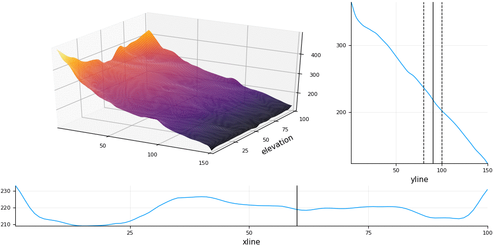
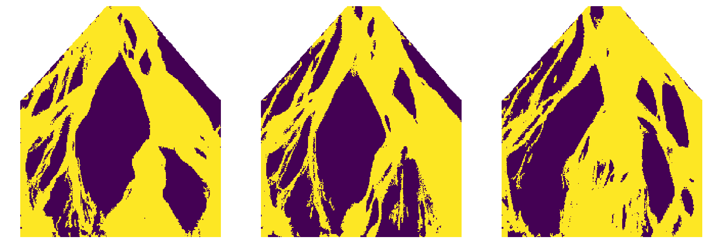
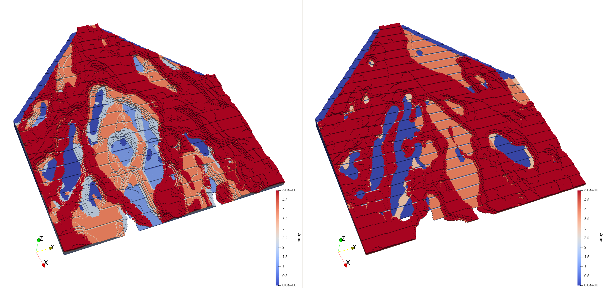

# StratiGraphics.jl

*A tool for creating 3D stratigraphy from 2D geostatistical processes.*

[![][travis-img]][travis-url] [![][codecov-img]][codecov-url]



This package provides an implementation of Markov-Poisson sampling as described
in [Hoffimann 2018](https://searchworks.stanford.edu/view/12746435). In this method,
geostatistical algorithms from the [GeoStats.jl](https://github.com/juliohm/GeoStats.jl)
framework are used to quickly generate surfaces of a 3D stratigraphic model.

## Installation

Get the latest stable release with Julia's package manager:

```julia
] add StratiGraphics
```

## Usage

To illustrate the usage of the package, consider a set of satellite images containing
spatial patterns that we would like to reproduce in a 3D stratigraphic model:



Each image can serve as a training image for a multiple-point geostatistical process
such as [ImageQuilting.jl](https://github.com/juliohm/ImageQuilting.jl):

```julia
using ImageQuilting

solver1 = ImgQuilt(:land => (TI=TI1, tilesize=(30,30,1)))
solver2 = ImgQuilt(:land => (TI=TI2, tilesize=(30,30,1)))
solver3 = ImgQuilt(:land => (TI=TI3, tilesize=(30,30,1)))

procs = [GeoStatsProcess(solver) for solver in [solver1,solver2,solver3]]
```

We define a geological environment as a set of geological processes, a set of transition
probabilities between the processes, and an event duration process:

```julia
using StratiGraphics

# transition probabilities
P = rand(3,3)
P = P ./ sum(P, dims=2)

# event duration process
ΔT = ExponentialDuration(1.0)

env = Environment(procs, P, ΔT)
```

We can simulate the envinroment from an initial state (e.g. flat land) and for a number of
epochs to produce a geological record:

```julia
nepochs = 10

init = LandState(zeros(100,100))

record = simulate(env, init, nepochs)
```

From the record, we can produce the strata in the form of surfaces:

```julia
strata = Strata(record)
```

We can choose between an `:erosional` (default) versus a `:depositional` stacking:

```julia
strata = Strata(record, :depositional)
```

We can then convert the surfaces into a 3D voxel model by specifying the vertical resolution:

```julia
voxelize(strata, 50) # produce a 100x100x50 voxel model
```



For a reproducible example, please check [this notebook](https://nbviewer.jupyter.org/github/juliohm/StratiGraphics.jl/blob/master/docs/Usage.ipynb).

## Citation

If you find StratiGraphics.jl useful in your work, please consider citing the thesis:

```latex
@PHDTHESIS{Hoffimann2018,
  title={Morphodynamic Analysis and Statistical Synthesis of Geomorphic Data},
  author={Hoffimann, J{\'u}lio},
  school={Stanford University},
  url={https://searchworks.stanford.edu/view/12746435},
  year={2018},
  month={September}
}
```

## Asking for help

If you have any questions, please [open an issue](https://github.com/juliohm/StratiGraphics.jl/issues).

[travis-img]: https://travis-ci.org/juliohm/StratiGraphics.jl.svg?branch=master
[travis-url]: https://travis-ci.org/juliohm/StratiGraphics.jl

[codecov-img]: https://codecov.io/gh/juliohm/StratiGraphics.jl/branch/master/graph/badge.svg
[codecov-url]: https://codecov.io/gh/juliohm/StratiGraphics.jl
